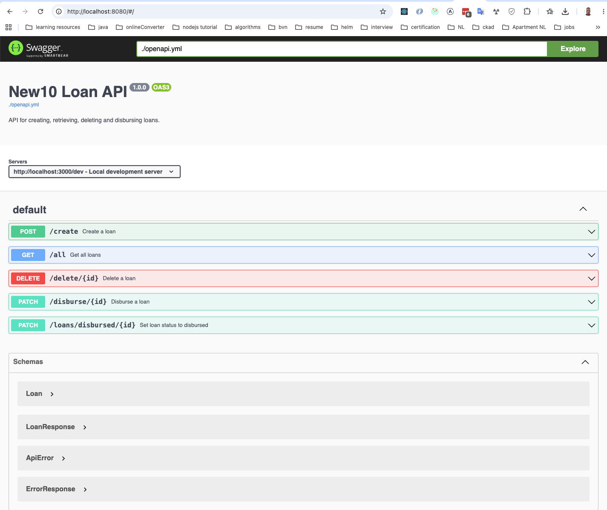
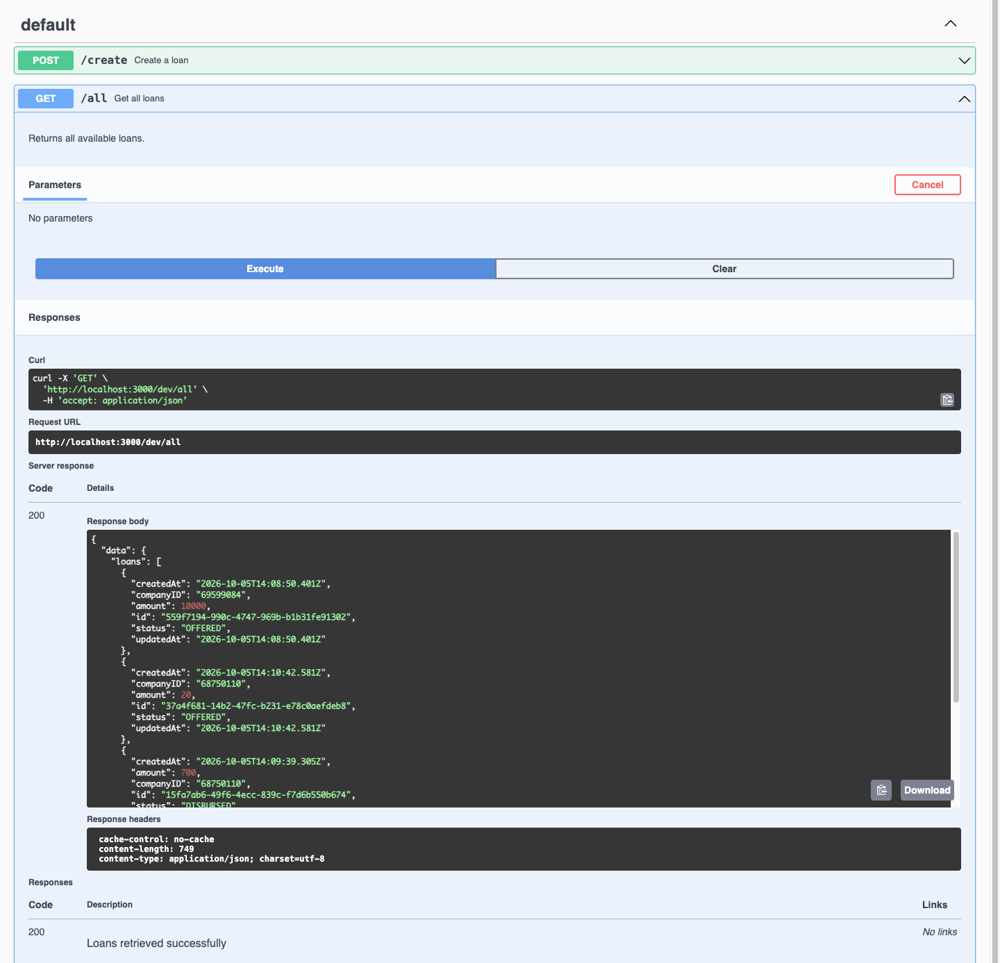

# Node.js Assignment (Serverless)

Backend implementation for the New10 technical assignment.

## Prerequisites

- Node.js 20+
- npm
- Docker

No environment variables need to be configured manually for local development. See serverless file.

## Running locally

Install dependencies:

    nvm use && npm ci

Start the application and local DynamoDB:

    npm start

The API is available at:

    http://localhost:3000/dev

## Tests

Run the unit tests:

    npm test

## API
You can use swagger ui run against the openapi.yml file in the code base for a better UI experience.

### Create loan

    curl -X POST http://localhost:3000/dev/create -H "Content-Type: application/json" -d '{"amount":10000,"companyID":"69599084"}'

### Get all loans

    curl http://localhost:3000/dev/all

### Delete loan

Replace the ID with an existing loan ID:

    curl -X DELETE http://localhost:3000/dev/delete/f0982a88-2767-4161-be38-ace0246b4d39

### Disburse loan

Replace the ID with an existing loan ID:

    curl -s -X PATCH http://localhost:3000/dev/disburse/95534cc6-c265-4644-a5b9-f07d539de093 | jq

## Authorization approach for disbursement endpoint
According to the assessment, the status-update endpoint on app2 is intended to be called only by the disburse flow in app1.

### Manual current solution
I ensured only the disbursement handler is able to call the internal disbursement API by providing an internal secret that only our internal implementation knows. This allows us to authorize the request by checking this secret.

```ts
        // Manual internal authorization
       if (!event.headers?.internal_hash || event.headers.internal_hash !== process.env.INTERNAL_AUTH_SECRET) {
            return {
                statusCode: 403,
                body: JSON.stringify({
                    errors: [
                        {
                            code: 'FORBIDDEN',
                            message: 'forbidden'
                        },
                    ],
                }),
            }
       }
```

This was done using a simple variation of string equality.
In prod, we would use say HMAC, sign the request, params, path, method and any other valid fields with the url then the target handler would recompute with similar mechanism and compare.

### Idea solution
For AWS lambdas, this is easily done with AWS IAM or roles.
We can combine this with the serverless authorizer `aws_iam`.

See [serverless authorization docs](https://www.serverless.com/framework/docs/providers/aws/events/apigateway#http-endpoints-with-aws_iam-authorizers)

We can also use custom middleware handlers with `authorizerFunc` if we want custom authorization.


## API Documentation

The OpenAPI specification is available at `docs/openapi.yml`.

To view and interact with the API using Swagger UI:

    docker run --rm -p 8080:8080 -e SWAGGER_JSON=/docs/openapi.yml -v "$(pwd)/docs:/docs" swaggerapi/swagger-ui

Open:

    http://localhost:8080

The `docs` directory is mounted into the container, so changes to `openapi.yml` are reflected after refreshing Swagger UI.

### Swagger UI





## Implementation Notes

Loan creation validates the supplied company ID against the KVK test API before persisting the company and loan.

Loan disbursement is split between two handlers communicating over HTTP. The public disbursement handler requests the internal loan-status handler to update the loan status to `DISBURSED`.

DynamoDB Local is used for local development and is started through Docker; all handled by serverless.

## Screenshots

### Serverless running locally


### DynamoDB tables


### Tests


