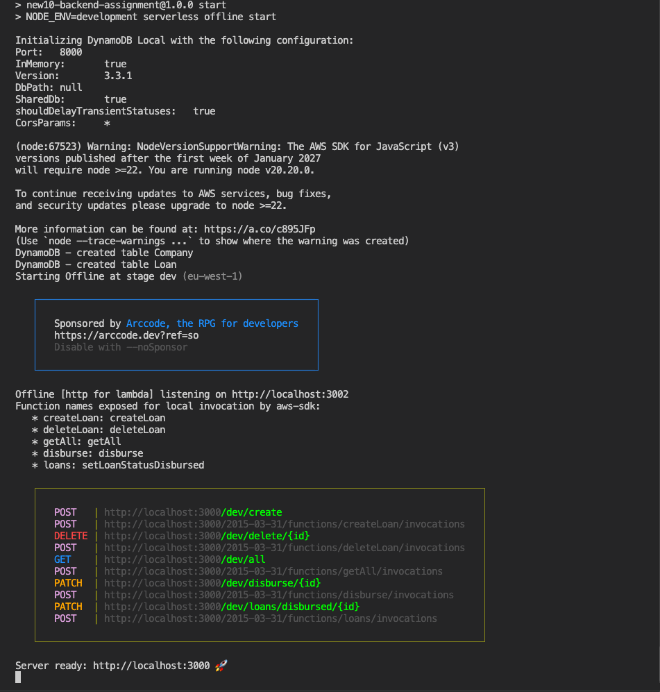
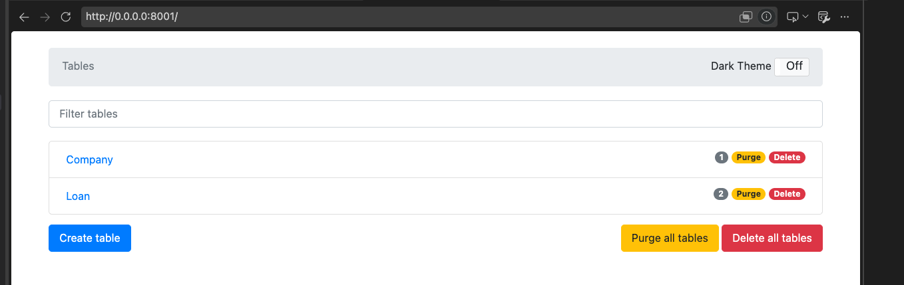
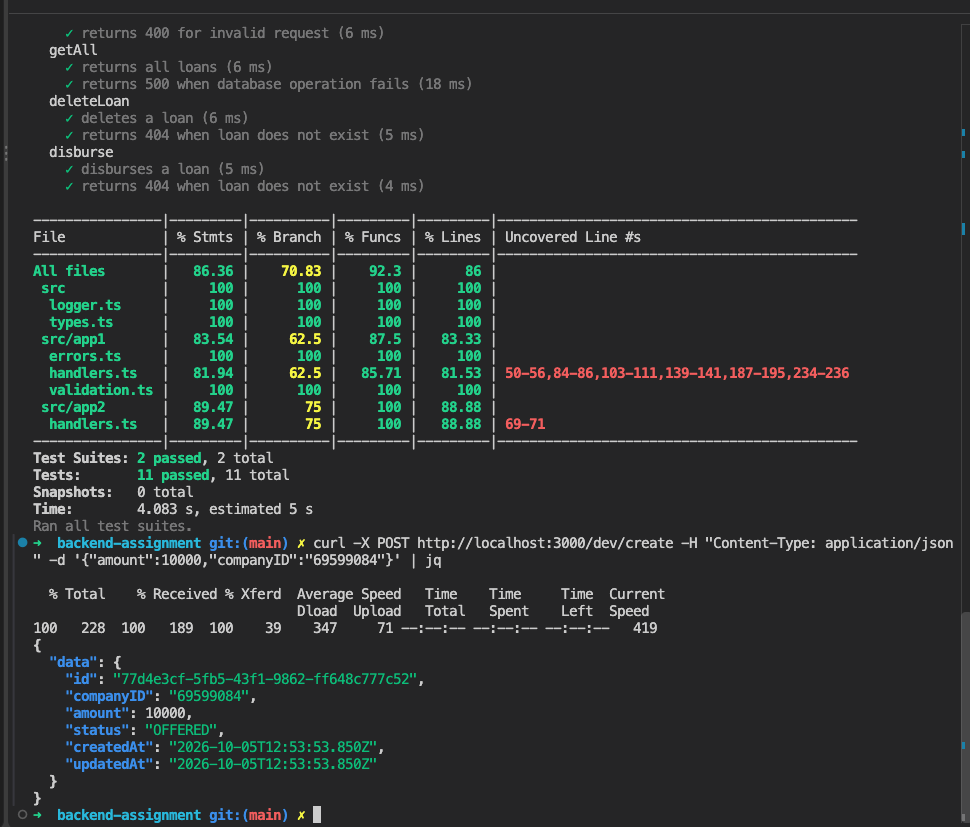

# Node.js Assignment (Serverless)

Congratulations, and welcome to the New10 Technical assignment!

We would like to see you (re)write a small NodeJS / Serverless app to showcase your knowledge of backend, serverless and API design using modern backend tools, as well as debug and make the necessary updates to maintain the functionality in a corresponding React web app. Below you will find some recommendations from us on how you should approach this assignment, as well as a short brief for the app’s requirements.

Additionally we have provided some instructions on how to share your project with us. Please don’t hesitate to reach out with any further questions and enjoy!

[[_TOC_]]

## Things to know before getting started

- The main goal of this assignment is to test your skills in understanding an existing application and implementing new, well tested, functionality.
- Note that the current code is full of bad practices and inconsistencies, it's your job to refactor to best practices and standards that keep the code readable and simple.
- The app should be built using NodeJS and the Serverless Framework (already setup in the existing codebase).
- Feel free to use any additional NPM libraries you need to build/refactor the app.
- Don’t feel too restricted by the provided codebase, it's serving only as a reference and to also help us evaluate your approach to refactoring existing codebases. Feel free to move, delete and create as many files as you need.
- The app should run offline, so there's no need to deploy it anywhere.
- Although the existing codebase is using JavaScript, TypeScript is also accepted. A minimal `tsconfig.json` and the relevant `@types/*` packages are pre-installed so you can start writing `.ts` files immediately. Wiring up the build/test pipeline  is your call if you go that route.

## Time expectation

We suggest aiming for **4 hours** of focused work on this assignment. We value pragmatism and prioritization, it's okay to leave `TODO` comments describing what you would do with more time.

## Keep it simple

Simplicity, clarity and pragmatism are valued over architectural sophistication. Only add abstractions that earn their complexity — a well-structured flat codebase is preferred over a deeply nested one that adds cognitive overhead. We're looking for production-quality judgement on a small surface, not a showcase of every pattern you know.

## The assignment

Take our existing “legacy” loan application and deliver an updated functional API which allows for viewing and managing loans (creation, disbursement and deletion). The application should use both the NodeJS runtime and the Serverless framework (offline).

### Requirements

#### Backend

1. Redesign the API and implement proper validations on inputs, including proper error messages and status code.
2. Extend the `/create` loan endpoint to also receive the `id` of the company applying for the loan.
    - Ensure the `id` is validated with [Test KVK API](#test-kvk-api) (see more info about the Test KvK API below), only companies present in this API should be accepted.
    - You should store all information about the company on DynamoDB.
3. Implement a new endpoint for the disburse functionality. This must be implemented as **two separate handlers** that communicate over HTTP, simulating a service-to-service call:
    - `app1`: exposes the public disburse endpoint and makes an HTTP call to `app2` to update the loan.
    - `app2`: exposes a status-update endpoint that processes the request and updates the loan status to `disbursed`.
    - The names `app1` and `app2` are not prescriptive — feel free to rename/reorganize the folders to fit your new structure. What we want to see is two handlers that talk to each other over HTTP.
    - The status-update endpoint on `app2` is intended to be called **only** by the disburse flow in `app1`. Decide how you want to prevent other callers from invoking it directly and briefly note your reasoning in the README. Any sensible approach is acceptable — we'll discuss the trade-offs during the review.
4. Ensure the [OpenAPI specification](./docs/openapi.yml) reflects all the changes made to the API (codebase).
5. Cover each endpoint with unit tests for at least the happy path **and** one error/validation scenario. We don't expect 100% coverage — we want to see your testing judgment about what's worth covering and what isn't.
6. **Pagination is out of scope.** When you redesign the list endpoint, you can return all loans in a single response without pagination. We won't penalize the absence of pagination, and we don't need you to add it.
7. Apply appropriate logging for observability. Think about what you'd need to debug an issue in production. You don't need to integrate a real logging platform — show the intent in the code.

#### Frontend (fullstack position only)

> Please only work on the frontend requirements below in case you're applying for a fullstack position.

1. Update web app to best practices while maintaining a functional state to Create, Disburse, and Delete loans
    - Styling/design updates for Web App are not necessary for the assignment, unless it hurts your eyeballs to see such a user-unfriendly UI 😉
2. Successfully run the provided integration tests to validate functionality
    - [`web/tests/integration.spec.js`](./web/tests/integration.spec.js) is your acceptance contract — your implementation must make it pass. The UI contracts the test relies on (test ids, accessible labels, empty-state copy, etc.) are documented in [web/README.md](./web/README.md#ui-contracts).
    - If you find a genuine issue with the test, you're free to change it — just call out what you changed and why in your README so we can discuss it during the review.

### Test KVK API

An open (test) API provided by the Dutch Chamber of Commerce, with some mock companies and data about them. It’s free to use and does not require registration. You can follow the instructions at [https://developers.kvk.nl/documentation/testing](https://developers.kvk.nl/documentation/testing) to use the API.

- Note that the company `id` mentioned above refers to `kvkNummer` in this Test API.
- The "test" API key is `l7xx1f2691f2520d487b902f4e0b57a0b197`

Example: in order to get data from a company based on its KVK number, the request should look like this:

```bash
curl -H "apikey: l7xx1f2691f2520d487b902f4e0b57a0b197" https://api.kvk.nl/test/api/v1/naamgevingen/kvknummer/69599084
```

### Tips

- Think about the API: Does it make sense? Does it follows the best practices?
- Think about your error handling flow.
- Think about the libraries used, don’t take the libraries that we included as mandatory.
- Rethink how the example project uses async/await.
- If changes are necessary for running the applications, please update the README documentation

## Getting started with the codebase

### Pre-requisites

- NodeJS >= v20
- [Serverless Framework v3](https://www.npmjs.com/package/serverless) (already installed in this project)
- Docker

### Getting started

1. Please clone this repository to your own space, making sure you create your new version as a Private repo (See further instructions below on how to share when finished).
2. The project is already setup for local development, so getting up to speed should be a no-brainer. It is pre-configured to run completely offline and should not require the deployment of any resources to AWS or elsewhere. See app README files below for specific "Getting Started" information:
    - [Backend Server documentation](./src/README.md)
    - [Frontend Web App documentation](./web/README.md)

IMPORTANT: If you encounter any issues with setting up or running the project, feel free to get in touch with us.

## Pre-submit checklist

Before you share your submission, please run through the following on a fresh checkout:

- [ ] `npm install` completes cleanly from the root
- [ ] `npm test` passes
- [ ] `npm start` boots the offline server without errors
- [ ] If you're applying for a fullstack position (or a position that expects frontend knowledge): `npm install` and `npm test` in `/web` succeed and the [integration tests](./web/tests/integration.spec.js) pass against your running backend
- [ ] [README.md](./README.md), [src/README.md](./src/README.md) and (if applicable) [web/README.md](./web/README.md) reflect any setup changes you made
- [ ] Any deliberate trade-offs or `TODO`s are called out in the README so we can discuss them during the review

## Uploading and sharing your project 🚀

Once you have finished, please send us back the link to your newly created private version of the assignment (preferably on GitLab or GitHub). Before sending, please don’t forget to give us access to the project, so that we can review and pull down the code to run locally.

- GitLab: @sean.kiefer / @rictorres.new10
- GitHub: @sean6bucks / @rictorres


# Solution

Backend implementation for the New10 technical assignment.

## Prerequisites

- Node.js 20+
- npm
- Docker

No environment variables need to be configured manually for local development. See serverless file.

## Running locally

Install dependencies:

    npm ci

Start the application and local DynamoDB:

    npm start

The API is available at:

    http://localhost:3000/dev

## Tests

Run the unit tests:

    npm test

## API
You can use swagger ui run against the openapi.yml file in the code base for a better UI experience.

### Create loan

    curl -X POST http://localhost:3000/dev/create -H "Content-Type: application/json" -d '{"amount":10000,"companyID":"69599084"}'

### Get all loans

    curl http://localhost:3000/dev/all

### Delete loan

Replace the ID with an existing loan ID:

    curl -X DELETE http://localhost:3000/dev/delete/f0982a88-2767-4161-be38-ace0246b4d39

### Disburse loan

Replace the ID with an existing loan ID:

    curl -s -X PATCH http://localhost:3000/dev/disburse/95534cc6-c265-4644-a5b9-f07d539de093 | jq

## API Documentation

The OpenAPI specification is available in `docs/openapi.yml`.

## Implementation Notes

Loan creation validates the supplied company ID against the KVK test API before persisting the company and loan.

Loan disbursement is split between two handlers communicating over HTTP. The public disbursement handler requests the internal loan-status handler to update the loan status to `DISBURSED`.

DynamoDB Local is used for local development and is started through Docker; all handled by serverless.

## Screenshots

### Serverless running locally



### DynamoDB tables



### Tests

